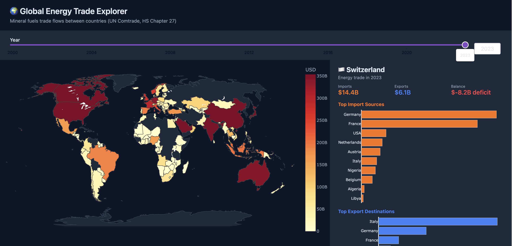

# Global Energy Trade Flows — COM-480 Data Visualization

Interactive visualization of global energy trade dependencies using UN Comtrade data.


## Project Description

This project explores how countries trade energy products (oil, gas, coal, petroleum derivatives) over time. The goal is to build interactive visualizations that reveal trade dependencies, bilateral flows, and structural shifts in the global energy market.

**Course:** COM-480 Data Visualization (EPFL)
**Milestone 1 scope:** Dataset acquisition, preprocessing, data quality assessment, exploratory data analysis, and project framing.

## Folder Structure

```
Vizion/
├── README.md
├── Milestone1.pdf
├── requirements.txt
├── app.py                  ← Dash interactive dashboard
├── data/
│   ├── raw/                ← Raw Comtrade download (not committed)
│   │   └── README.md       ← Download instructions
│   └── processed/          ← Generated by the pipeline
│       ├── energy_trade.csv
│       ├── country_summary.csv
│       └── partner_summary.csv
├── notebooks/
│   ├── 00_data_quality_assessment.ipynb   ← Data quality & feasibility checks
│   ├── 01_data_loading_and_cleaning.ipynb ← Preprocessing walkthrough
│   └── 02_exploratory_data_analysis.ipynb ← EDA & insights
├── src/
│   ├── config.py             ← Paths and constants
│   ├── data_loader.py        ← Load & normalize raw Comtrade data
│   ├── preprocess.py         ← Filter, clean, aggregate
│   ├── eda.py                ← Analysis & plotting helpers
│   ├── utils.py              ← Country standardization, ISO-3 codes
│   └── download_comtrade.py  ← UN Comtrade API downloader
├── outputs/
│   ├── figures/              ← Saved EDA plots
│   └── tables/               ← Saved summary tables
└── docs/
    └── milestone1_notes.md   ← Milestone 1 report 
```

## Setup

```bash
# 1. Clone the repo
git clone <repo-url>
cd com480-trade-viz

# 2. Create a virtual environment
python3 -m venv .venv
source .venv/bin/activate   # Windows: .venv\Scripts\activate

# 3. Install dependencies
pip install -r requirements.txt

# 4. Download the raw data (see below)

# 5. Run the preprocessing notebook, then open the dashboard
jupyter notebook
python app.py
```

## How to Get the Data

Data is fetched programmatically from the **UN Comtrade API**:

```bash
export COMTRADE_API_KEY="your-key-here"
python -m src.download_comtrade
```

This downloads HS Chapter 27 (mineral fuels) bilateral trade data for all countries, 2000–2023, and saves it to `data/raw/comtrade_energy_trade.csv`.

**Getting a free API key:**
1. Go to [https://comtradedeveloper.un.org](https://comtradedeveloper.un.org)
2. Sign up and subscribe to the **comtrade - v1** product (free tier)
3. Copy your Primary Key from the profile page

See [`data/raw/README.md`](data/raw/README.md) for full details and rate limit information.

## Dashboard Preview

The interactive dashboard (`app.py`) runs locally at `http://127.0.0.1:8050` and includes:

- **Choropleth world map** — countries colored by energy trade volume (yellow → red scale), updated live with the year slider
- **Year slider (2000–2023)** — scrub through 24 years of trade data
- **Flow toggle** — switch between Total trade / Imports only / Exports only
- **Country side panel** — click any country to instantly see:
  - Total imports, exports, and trade balance for the selected year
  - Bar chart of top 10 import sources
  - Bar chart of top 10 export destinations

```bash
python app.py
# Open http://127.0.0.1:8050
```

---

## Running the Notebooks

Run the notebooks in order:

1. **`01_data_loading_and_cleaning.ipynb`** — Loads raw data, runs the preprocessing pipeline, saves cleaned CSVs to `data/processed/`.
2. **`00_data_quality_assessment.ipynb`** — Systematic quality checks: completeness, coverage, ISO-3 matching, value sanity.
3. **`02_exploratory_data_analysis.ipynb`** — Full EDA: trade evolution, top countries, concentration/dependency, bilateral corridors, static choropleth preview. Figures saved to `outputs/figures/`.

Then launch the interactive dashboard:

```bash
python app.py
```

## Milestone 1 Scope

- [x] Dataset selection and acquisition (UN Comtrade API)
- [x] Data loading and preprocessing pipeline (`src/`)
- [x] Energy product filtering (HS Chapter 27)
- [x] Country name standardization with ISO-3 codes
- [x] Data quality assessment notebook
- [x] Exploratory data analysis notebook
- [x] Interactive Dash dashboard (choropleth + country panel)
- [x] Milestone 1 report (`docs/milestone1_notes.md`)
- [x] Related Work
