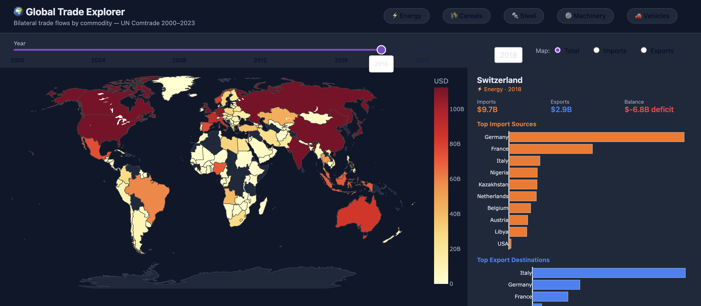
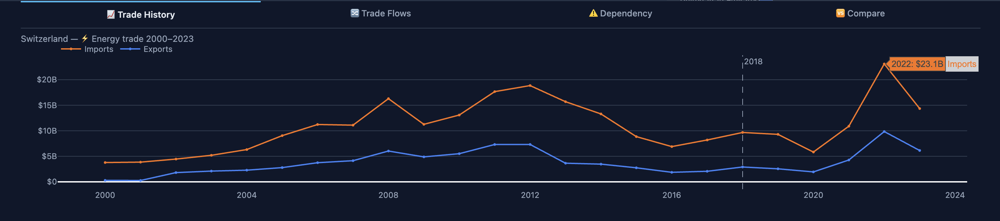
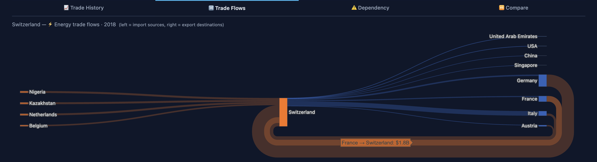
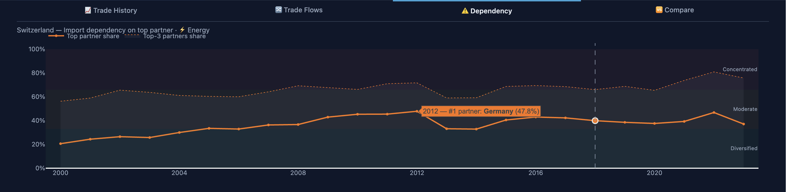
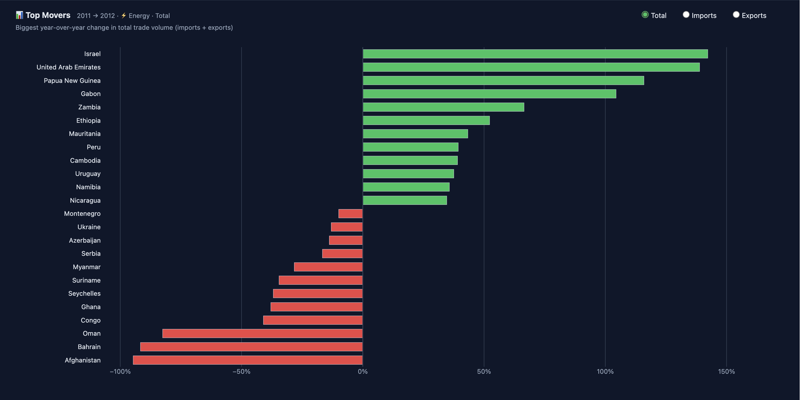
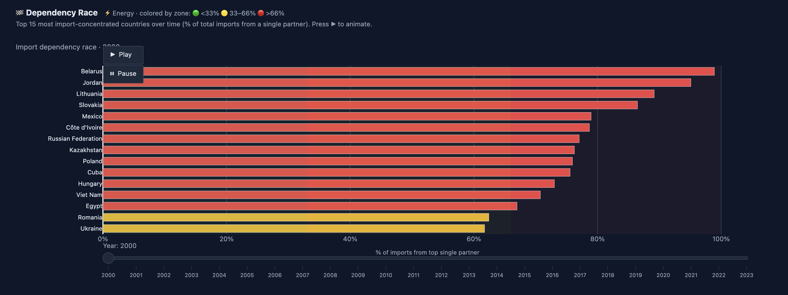
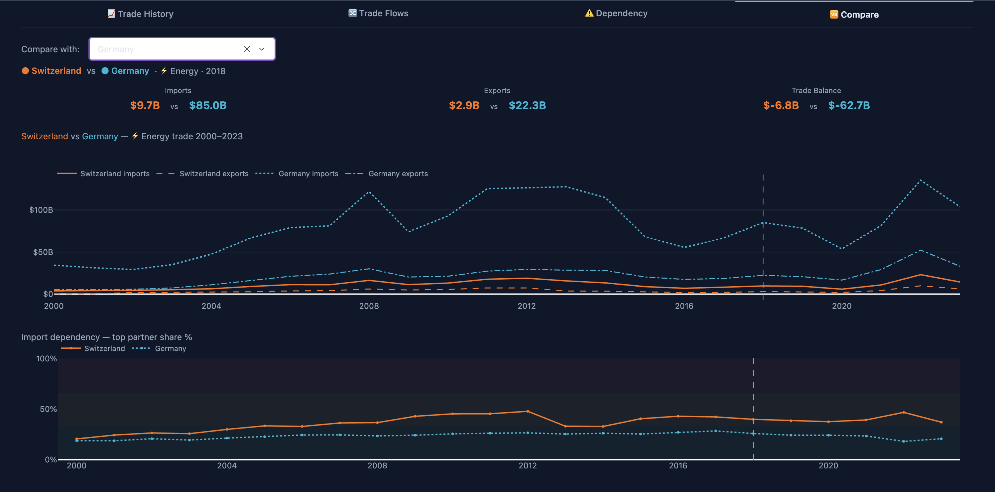

\thispagestyle{empty}

# Global Trade Explorer
### Dependencies, Flows & Disruptions

**COM-480 Data Visualization — Milestone 2**
Team COM-480 Trade Viz · 2026-04-17

> An interactive dashboard that makes global trade readable: *who trades
> what with whom*, **how concentrated** each country's trade is, **how
> exposed** it is to a single partner, and **how shocks propagate** through
> the network — across 2000–2023 and five commodity families.

\vspace{0.4cm}

{ width=100% }

\vspace{0.4cm}

**Live prototype:** <https://global-trade-viz.onrender.com>
*(Render free tier — first request after inactivity may take ~30–60 s to
cold-start while the container reloads; subsequent interactions are
instant.)*
**Repository:** <https://github.com/com-480-data-visualization/Vizion>

\newpage

## 1. Project Goal & Audience

We are building an interactive web dashboard that lets users explore global
bilateral trade flows (UN Comtrade, 2000–2023) across several commodity
families — **energy (HS 27)**, **cereals (HS 10)**, **iron & steel (HS 72)**,
**machinery (HS 84)** and **vehicles (HS 87)**.

Existing platforms (OEC, World Bank, UN Comtrade dashboards) answer *what*
was traded but rarely expose *structure* — concentration, dependency, and
fragility. Our dashboard pairs a familiar entry point (a choropleth world
map) with progressively deeper analytical views: time series with shock
annotations, Sankey flows, a per-country dependency panel, a "top movers"
bar, an animated dependency-race, and — as a stretch goal — a **disruption
simulator** that removes a country/link and shows how supply shortfalls
propagate.

**Target audience.** Students, researchers, and citizens interested in
global economics, geopolitics and supply-chain resilience. The design
prioritizes *progressive disclosure*: a newcomer sees a map; a power user
can drill into HHI values, animate dependency over time, and compare two
countries side-by-side.

## 2. Dataset

UN Comtrade, annual bilateral flows (reporter × partner × HS code × flow ×
USD), 2000–2023. After cleaning (year filter, ISO-3 normalization, removal
of aggregate entities such as "World" and "Areas, nes") we ship three
processed commodities (energy 393 k rows, cereals 230 k, steel 329 k) and
are downloading two more (machinery, vehicles) under the Comtrade free-tier
rate limit. Limitations: re-export inflation for hub countries (NLD, BEL,
SGP), nominal USD (no inflation adjustment), sparse coverage pre-2005.

\newpage

## 3. Visualizations

All views below are either **already working** in the prototype or
scaffolded behind a tab. Screenshots are from the running dashboard.

### (A) Choropleth World Map — entry point

Log-scaled USD, year slider (2000–2023), commodity dropdown
(Energy / Cereals / Steel / Machinery / Vehicles), import/export/total
toggle. Click a country → opens the detail panel (B–E). See the hero
screenshot on page 1 (Switzerland selected, Energy 2018 — import sources
dominated by Germany and France, export destinations led by Italy).

### (B) Trade History — country detail

Dual line (imports vs exports) over 2000–2023 with shock annotations (2008
crisis, 2014 oil crash, 2020 COVID, 2022 shock).

{ width=95% }

### (C) Sankey Flow Diagram — bilateral structure

Left = import sources, right = export destinations, ribbon width = USD
value for the selected country, commodity and year.

{ width=95% }

### (D) Dependency Panel — concentration over time

Top-partner share and top-3 partners share traced across 2000–2023, with
"Diversified / Moderate / Concentrated" bands to contextualize the value.

{ width=95% }

### (E) Top Movers — year-over-year change

Global YoY % change (diverging bars, green gainers / red losers), filtered
to countries above a trade-volume floor so rankings are not dominated by
noise.

{ width=95% }

### (F) Dependency Race — animated ranking

Animated ranking of "% of imports from top single partner" across years,
revealing diversification or lock-in trends per commodity.

{ width=95% }

### (G) Compare Mode — two countries side-by-side

Parallel mini-dashboards to contrast two countries (e.g., Germany vs Japan
on steel) on totals, history, and dependency profile.

{ width=95% }

\newpage

## 4. MVP vs Extensions

### Core (MVP — must ship for milestone 3)

1. Choropleth map + year slider + import/export toggle
2. Click-to-drill country detail panel (top-10 partners + history line)
3. Commodity dropdown covering ≥ 3 commodities
4. Sankey diagram of top bilateral flows
5. Dependency bar (top-5 partners + HHI) per country
6. Public deployment with the above reliably interactive

Each piece is **independent**: (1)–(3) rely only on `country_summary.csv`;
(4)–(5) rely only on `partner_flow.csv`. They share no state other than the
current selection, so we can ship them in any order.

### Extensions (nice-to-have, droppable without breaking the narrative)

- **Disruption simulation** — user removes a country/link; the dashboard
  recomputes who loses what share of supply (propagation via re-routing).
- **Chord diagram** alternative view of the network (D3 embed).
- **Top Movers** and **Dependency Race** (already scaffolded).
- **"Explain this chart"** narrative side-captions (Storytelling lecture).
- **Search-as-you-type** country finder.
- **Mobile-friendly responsive layout.**

## 5. Tools & Lectures

| Need                   | Tool                                      | Lecture(s)                     |
| ---------------------- | ----------------------------------------- | ------------------------------ |
| Map projection         | Plotly `choropleth`, ISO-3                | Maps; Perception               |
| Time series            | Plotly lines + shock bands                | Time-series; Annotation        |
| Flows                  | Plotly `sankey`                           | Graphs & networks              |
| Rankings / composition | Plotly `bar`                              | Rankings; Composition          |
| Animation              | Plotly `frames`                           | Animation; Interaction         |
| Layout & callbacks     | **Dash** (Python, Flask)                  | Interaction; Web viz tooling   |
| Data wrangling         | **pandas**, **NumPy**                     | (prerequisite)                 |
| Deployment             | Render / HF Spaces                        | (engineering)                  |

Future lectures we expect to lean on: **Storytelling** (narrative
captions), **Graphs & Networks** (Sankey refinement, optional force layout),
**Evaluation & Perception** (color scales, legend validation).

## 6. Prototype Status & Risks

**Running locally** (`python app.py`, localhost:8050): choropleth, year
slider, commodity dropdown, country detail panel with Trade History /
Sankey / Dependency / Compare tabs, global Top Movers chart, Dependency
Race animation, preprocessing pipeline, EDA notebook.

**Gaps before milestone 3.** Ship the disruption simulator; polish color
scale and mobile layout; add shock annotations to the history chart;
improve mobile responsiveness.

**Risks.** *API quota* (500 calls/day) — mitigated by per-commodity CSV
caching. *Missing ISO-3 codes* (~10% of partners) — manual override in
`src/utils.py`. *Re-export inflation* — flagged in the EDA; dependency
metric uses direct partner share. *Scope creep* — the MVP (§4) is
independent of every extension, so extensions can be dropped without
breaking the story.
